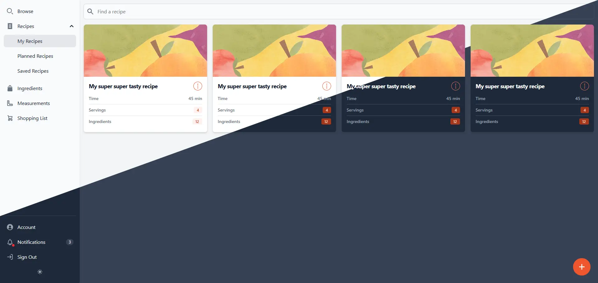

## Introduction

Recipe Manager (name not final) does exactly what it says on the box, it is a self-hostable recipe manager written
in Go (backend) and Svelte (frontend). The application requires no external dependencies when run as a docker container. 
It uses a SQLite database to store the recipes and the file system for storing media.



## Running the Application

### With Docker (Recommended)

1. Pull the image
   ```
   docker pull ghcr.io/wolfsblu/recipe-manager:latest
   ```
2. Copy the `.env.example` file to `.env` and modify as needed
3. Launch the container
   ```
   docker run -d --env-file .env -p 8080:8080 -v uploads:/data/uploads recipe-manager
   ```
4. Open the [frontend](http://localhost:8080) or browse the [API](http://localhost:8080/api/docs)

### Natively

Assuming you want to run the binary bare-metal with Go:

1. Download the DB schema migration tool [atlas](https://atlasgo.io/docs)
   ```
   curl -sSf https://atlasgo.sh | sh
   ```
2. Download dependencies and generate API server and SQL queries
    ```
    go mod tidy
    go generate
    ```
3. Build the frontend application
    ```
    npm --prefix webapp install
    npm --prefix webapp run build
    ```
4. Build the project
    ```
    go build -o ./tmp/main
    ```
5. Copy the .env file and provide values for any empty variables
    ```shell
    cp .env.example tmp/
    ```
6. Start the server
    ```
    ./tmp/main
    ```
7. Open the [frontend](http://localhost:8080) or browse the [API](http://localhost:8080/api/docs)